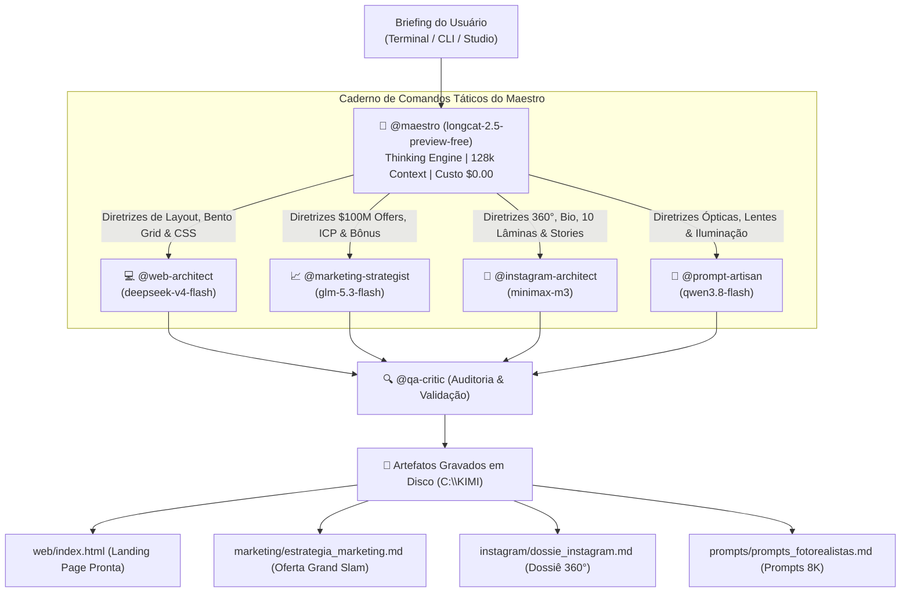

<div align="center">

# ⚡ NEXUS SWARM HARNESS
### Autonomous Multi-Agent AI Swarm Engine for Kimi Code CLI & OpenCode Go

[](https://opensource.org/licenses/MIT)
[](https://github.com/moonshot-ai/kimi-code)
[](https://opencode.ai)
[](https://opencode.ai)
[](https://opencode.ai)

<p align="center">
  <b>O mais avançado ecossistema multi-agente autônomo para dominação digital.</b><br/>
  Projetado para criar landing pages de altíssima conversão, arquitetar ofertas $100M no modelo Alex Hormozi, modelar perfis de Instagram em 360° e produzir prompts fotorealistas para Midjourney v6.1 e Flux.1 com zero placeholders.
</p>

[Visão Geral](#-visão-geral) •
[Arquitetura](#-arquitetura-do-enxame) •
[Topologia de IAs](#-topologia-de-especialistas) •
[Instalação](#-instalação-rápida) •
[Como Usar](#-modos-de-operação) •
[Prompt Cache](#-economia-extrema--prompt-cache)

</div>

---

## 🌟 Visão Geral

O **Nexus Swarm Harness** transforma o terminal em uma central de inteligência distribuída. Um único comando no terminal aciona uma rede neural de agentes especializados que trabalham de forma simultânea e coordenada:

1. **💻 Criador Supremo de Sites (`@web-architect`)**: Gera landing pages completas em HTML5 + Tailwind CSS com Bento Grid assimétrico, micro-interações táteis, FAQ Accordion acessível com JavaScript nativo, SEO completo com OpenGraph e performance 100/100 no Lighthouse.
2. **📈 Estrategista de Neuromarketing (`@marketing-strategist`)**: Domínio total do framework **$100M Offers de Alex Hormozi** — calcula a Equação de Valor, projeta ICPs profundos em 4 dimensões, constrói Stacks de Bônus irrecusáveis, ancoragem numérica de preço (10x custo da inação) e garantias reversas de risco zero.
3. **📱 Modelador 360° de Instagram (`@instagram-architect` & `@copywriter-viral`)**: Disseca e modela contas de 8 dígitos — entrega Bios hipnóticas em 4 linhas, roteiriza os 5 Destaques vitais, redige Carrosséis de retenção infinita de 10 lâminas, roteiros de Reels com ganchos de 3 segundos e sequências diárias de Stories 24h para vendas na DM.
4. **🎨 Diretor de Arte & Engenharia Visual (`@prompt-artisan`)**: Converte briefings em prompts de precisão cirúrgica para **Midjourney v6.1** e **Flux.1** com a Matriz dos 7 Elementos, emulação de câmeras reais (Hasselblad X2D 100C, Sony A7R V, Leica M11), lentes (85mm f/1.4, 35mm), renderização 3D de mockups e capas de destaques.
5. **🛡️ Auditor Implacável (`@qa-critic`)**: Realiza auditoria rigorosa de consistência e zero placeholders antes da entrega final.

---

## 🏛️ Arquitetura do Enxame



---

## 🤖 Topologia de Especialistas

O ecossistema é otimizado para **custo mínimo com velocidade máxima**, permitindo centenas de chamadas diárias sem esgotar cotas:

| Papel | IA Alocada | Custo / 1M Tokens | Missão no Enxame |
| :--- | :--- | :--- | :--- |
| **`@maestro`** | `longcat-2.5-preview-free` | **$0.00 (ILIMITADO)** | **Orquestrador Central**: Raciocínio nativo (Thinking Tokens), 128k context. Decompõe qualquer briefing em 4 diretrizes táticas com custo zero. |
| **`@web-architect`** | `deepseek-v4-flash` | $0.15 input · $0.60 output | **Engenharia Frontend**: Landing pages modernas com Bento Grid, Tailwind CDN, FAQ Accordion e zero placeholders. |
| **`@marketing-strategist`** | `glm-5.3-flash` | $0.15 input · $0.50 output | **Neuromarketing**: Oferta Grand Slam ($100M Offers de Alex Hormozi), Stack de Bônus e garantias reversas. |
| **`@instagram-architect`** | `minimax-m3` | $0.30 input · $1.20 output | **Engenharia Social**: Bio em 4 linhas, 5 destaques, carrossel de 10 lâminas, reels de 45s e stories 24h. |
| **`@prompt-artisan`** | `qwen3.8-flash` | $0.15 input · $0.47 output | **Direção de Arte**: Prompts cinematográficos para Midjourney v6.1 e Flux.1 com parâmetros de câmeras e iluminação real. |
| **`@qa-critic`** | `longcat-2.5-preview-free` | **$0.00 (ILIMITADO)** | **Auditoria Implacável**: Valida conformidade técnica e checklist de qualidade sem custos. |

---

## 📂 Estrutura do Repositório

```
harness/
├── AGENTS.md                  # Protocolo Mestre, Constituição e Matriz de Decisão do Enxame
├── config.example.toml        # Template de configuração do Kimi Code CLI
├── opencode.example.json      # Template de configuração para OpenCode CLI
├── .env.example               # Template de variáveis de ambiente
├── .gitignore                 # Blindagem contra exposição de credenciais e caches
├── swarm.js                   # Motor de despacho em paralelo com fallback inteligente
├── swarm-cli.js               # Terminal interativo REPL com comandos em tempo real
├── swarm.bat                  # Atalho em 1 clique para o terminal interativo
├── server.js                  # Servidor de API local e suporte à Web UI
├── studio.html / studio.bat   # Plataforma Web com preview ao vivo (localhost:3000)
├── package.json               # Metadados e scripts de execução
├── skills/                    # Manuais de habilidades especializadas
│   ├── web-crafting/          # Bento Grid, Tailwind CSS, JS de FAQ, SEO OpenGraph, WCAG
│   ├── instagram-modeling/    # Engenharia reversa, Bios, 10 Lâminas, Reels e Hashtags 3x3x3
│   ├── growth-marketing/      # $100M Offers Alex Hormozi, Stack de Bônus e Ancoragem Numérica
│   └── prompt-art-engine/     # Matriz 7 elementos, Midjourney v6.1, Flux.1 e Mockups 3D
├── templates/                 # Blueprints prontos para produção
│   ├── landing-page-elite.html# Boilerplate de Landing Page com Tailwind CDN
│   ├── instagram-profile-dossier.md # Dossiê de modelagem de conta e concorrência
│   ├── carousel-10-slides.md  # Estrutura perfeita para carrosséis de alta retenção
│   ├── stories-24h-funnel.md  # Sequência diária de Stories para vendas na DM
│   └── image-prompt-generator.md # Gerador de prompts e capas de destaques
├── web/                       # Landing pages geradas
├── marketing/                 # Estratégias e funis gerados
├── instagram/                 # Dossiês e carrosséis gerados
└── prompts/                   # Prompts fotorealistas gerados
```

---

## 🚀 Instalação Rápida

### 1. Clonar o Repositório
```bash
git clone https://github.com/dedss22/harness.git
cd harness
```

### 2. Configurar Suas Credenciais
Copie os arquivos de exemplo:
```bash
cp .env.example .env
cp config.example.toml config.toml
cp opencode.example.json opencode.json
```

Abra o arquivo `.env` e insira sua chave da [OpenCode Go](https://opencode.ai):
```env
OPENCODE_API_KEY=oc_sk_sua_chave_aqui
```

---

## 💻 Modos de Operação

### Opção 1: Terminal Interativo do Enxame (REPL)
Execute no terminal:
```bash
.\swarm.bat
```
*(Ou execute `node swarm-cli.js`)*

#### Comandos Úteis no Prompt Interativo:
- `<qualquer briefing>`: Dispara o enxame quádruplo paralelo instantaneamente!
- `/ask <pergunta>`: Faz uma pergunta direta apenas para o Maestro (sem disparar o enxame inteiro, economizando tokens).
- `/free`: Comuta 100% da rede para o modelo gratuito e ilimitado (`longcat-2.5-preview-free`).
- `/flash`: Restaura a rede para os modelos Flash de alta velocidade.
- `/network`: Exibe a topologia ativa e quais IAs estão em cada papel.
- `/models <papel> <modelo>`: Altera dinamicamente o modelo de qualquer especialista.
- `/help`: Exibe o guia rápido de comandos.

---

### Opção 2: Disparo Direto via Linha de Comando
```bash
node swarm.js "Clinica de Harmonizacao Facial e Cirurgia Plastica de Alto Padrao"
```

---

### Opção 3: Kimi Code CLI Nativo
Com o `@moonshot-ai/kimi-code` instalado:
```bash
kimi
```
O Kimi CLI iniciará com o Maestro LongCat ativo, carregando o [AGENTS.md](AGENTS.md) e os manuais de `skills/`.

---

### Opção 4: Web Studio com Preview ao Vivo
Execute:
```bash
.\studio.bat
```
Acesse no seu navegador: `http://localhost:3000`. Permite selecionar a topologia com cliques, disparar a missão e visualizar o site renderizado em tempo real via iframe.

---

## ⚡ Economia Extrema & Prompt Cache

O harness implementa uma estratégia de três camadas para garantir operação contínua o mês inteiro:

1. **Prompt Caching de 98%**: O cabeçalho persistente `x-opencode-session = "swarm-persistent-cache"` força a OpenCode Go a reaproveitar o KV cache na GPU, derrubando o custo dos prompts de sistema para **$0.003 por 1M tokens**.
2. **Rede de Fallback Autônoma**: Se qualquer cota temporária de taxa for atingida (HTTP 429), o sistema pergunta interativamente no terminal se você deseja transferir para o `longcat-2.5-preview-free` e prossegue sem interromper a esteira.
3. **Escalonamento Anti-Gargalo**: Intervalo controlado de 600ms entre as chamadas paralelas com retentativa automática (`requestModelWithRetry`), evitando sobrecargas no gateway.

---

## 📄 Licença

Distribuído sob a licença **MIT**. Veja `LICENSE` para mais informações.

Desenvolvido com maestria por [@dedss22](https://github.com/dedss22).
